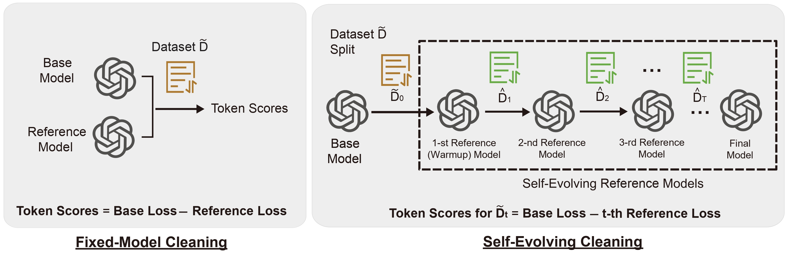

# Token Cleaning: Fine-Grained Data Selection for LLM Supervised Fine-Tuning

### Abstract
Recent studies show that in supervised fine-tuning (SFT) of large language models (LLMs), data quality matters more than quantity. 
While most data cleaning methods concentrate on filtering entire samples, the quality of individual tokens within a sample can vary significantly. After pre-training, even in high-quality samples, patterns or phrases that are not task-related can be redundant or uninformative. Continuing to fine-tune on these patterns may offer limited benefit and even degrade downstream task performance.
In this paper, we investigate token quality from a noisy-label perspective and propose a generic token cleaning pipeline for SFT tasks. Our method filters out uninformative tokens while preserving those carrying key task-specific information. Specifically, we first evaluate token quality by examining the influence of model updates on each token, then apply a threshold-based separation. The token influence can be measured in a single pass with a fixed reference model or iteratively with self-evolving reference models. The benefits and limitations of both methods are analyzed theoretically by error upper bounds. Extensive experiments show that our framework consistently improves performance across multiple downstream tasks.



<!-- - Reference: [Not All Tokens Are What You Need for Pretraining](https://openreview.net/pdf?id=0NMzBwqaAJ), NeurIPS 2024 best paper runner up. -->

## 🎉🎉 News 
- [x] [2024.02.01] 🚀🚀 Release the code of Token-Cleaning.


## Environment Preparation
To run training, evaluation, or inference for finetuned models, you need to install the required packages by running the following command (after installing pytorch):
```
pip install -r requirements.txt
```

## Dataset preparation

The data pool (50k samples) is constructed based on a new powerful data curation pipeline proposed by [DS2](https://openreview.net/pdf?id=DKkQtRMowq), which involves selecting data samples using quality rating scores generated by LLMs. For convenience, the 50k used samples can be accessed from Huggingface via the [link](https://huggingface.co/datasets/jlpang888/DS2_50k).

Our selected evaluation and training data are listed below.

| **Category**         | **Dataset**                                  |
|----------------------|----------------------------------------------|
| **Evaluation Data**   | MMLU, TruthfulQA, TydiQA, HellaSwag, BoolQ, ARC-C, LoqiQA|
| **Training Data**     | Flan v2, OASST1, WizardLM, Dolly, Stanford Alpaca |


## Code Running

Note that our cleaning pipelines consists of **Fixed-Model Cleaning** and **Self-Evolving Cleaning**. One can run the code by 

```bash
# Fixed-model cleaning
bash run_rho_baseline_global.sh

# Self-evolving cleaning
bash run_iter_pattern_new.sh
```

## Model Evaluation
The task performances are evaluated on the [lm-eval-hareness](https://github.com/EleutherAI/lm-evaluation-harness) repository.
For convenience, one can do evaluation by 

```bash 
bash run_eval_token_selection.sh
```


## Results Presentations

The tabular results can be printed via the `read_results.ipynb` jupyter notebook.


## Citation
If you used this repository, please cite our work:
```
@article{pang2025token,
  title={Token Cleaning: Fine-Grained Data Selection for LLM Supervised Fine-Tuning},
  author={Pang, Jinlong and Di, Na and Zhu, Zhaowei and Wei, Jiaheng and Cheng, Hao and Qian, Chen and Liu, Yang},
  journal={arXiv preprint arXiv:2502.01968},
  year={2025}
}

```